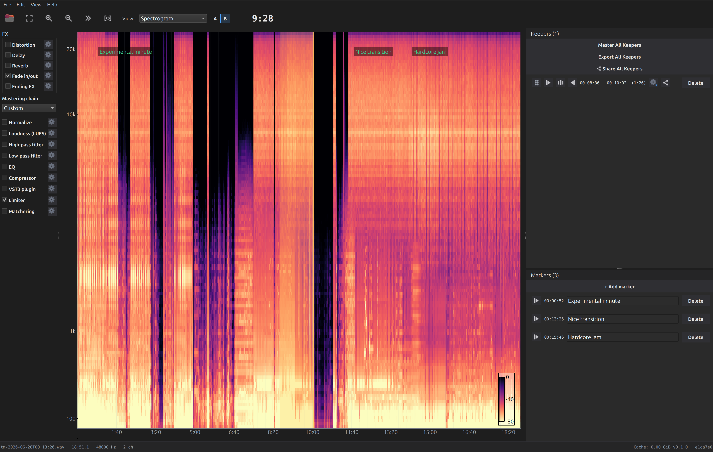

<div align="center">

# Marmelade

### Find the good parts of an 8‑hour jam — in minutes, not hours.

**Marmelade** is a desktop, DAW‑style waveform viewer and clip extractor built for musicians
who record long, unstructured jam sessions and need to locate, audition, master, and export
the musically valuable moments without scrubbing through every minute.

[](https://www.python.org/)
[](https://doc.qt.io/qtforpython/)
[]()
[](https://www.youtube.com/channel/UC_Ho3QBqN1_b0mI3dojosLg)

<br/>

<!-- Replace with your screenshot — see docs/screenshots/README.md -->


</div>

---

## What it does

Recording a live jam is easy. Finding the three great minutes buried in a six‑hour take is not.
Marmelade turns that hunt into a fast, visual workflow:

1. **Open** a long recording — up to ~8 hours per file. The waveform loads through a
   memory‑safe downsampled proxy, so it stays smooth to pan and zoom no matter how big the file is.
2. **Scan** it visually — switch between waveform render modes (amplitude, dB, energy, spectrogram)
   to spot where the music actually happens.
3. **Select** promising stretches and send them to your **Keepers** list.
4. **Audition** each keeper — play from the start, middle, or end, with the same fades your export will use.
5. **Master** each keeper with a full, configurable chain (EQ, compression, limiting, loudness, and more).
6. **Export** clean, losslessly‑trimmed clips with automatic naming and fades — or upload straight to YouTube.

Along the way, drop **Markers** anywhere on the timeline to annotate ideas you want to come back to.

---

## ✨ Features

**Fast navigation on huge files**
- Handles multi‑hour recordings (~8 h) without loading the raw audio into RAM — block‑based, downsampled proxy rendering
- Smooth pan/zoom on millions of samples (PyQtGraph, not Matplotlib)
- Click‑to‑seek, follow‑playhead mode, zoom‑to‑fit, and a large, always‑visible playback timecode

**Multiple waveform views**
- **Classic** amplitude, **dB‑scaled**, and **Energy** envelope modes
- Spectral modes: **Spectrogram**, **Spectral‑centroid tint**, and **RGB frequency‑band** rendering (lazily computed)
- Instant switching from the toolbar **View:** dropdown or the number keys **1–6**

**Region → Keepers workflow**
- Drag to mark a region; keyboard shortcuts to mark **Keeper / Trash / Unmark**
- A dedicated **Keepers** side panel with per‑row play, reorder, and delete
- **A/B preview** toggle to compare the raw source against the mastered result

**Per‑keeper mastering chain**
- Modular, reorderable stages: **Normalize**, **High‑pass / Low‑pass**, **3‑band EQ**, **Compressor**,
  **Limiter** (true‑peak / inter‑sample‑peak safe), **LUFS loudness target**, **Matchering** reference matching,
  **Ending FX**, and **Fade**
- Host any **VST3** plugin as a mastering stage (native editor, out‑of‑process)
- One‑click **genre presets**; settings persist per file

**Markers**
- Drop a marker at the exact playhead position with the **M** key or the **＋** button
- Editable text labels, jump‑and‑play from any marker, delete/rename
- Rendered on the waveform as a labelled line — and saved to disk so they survive reopening the file

**Lossless extraction & sharing**
- Export trimmed clips to **WAV** or **MP3** with automatic, descriptive naming and fades
- Batch **Export All Keepers**
- **YouTube upload** for single clips or a whole bundle, with license selection

**Under the hood**
- Consistent **48 kHz** canonical pipeline (non‑48 kHz sources are streamed‑resampled on open)
- Per‑file JSON sidecar stores your regions, markers, and mastering settings
- Background workers keep the UI responsive while analysis and export run

---

## 📺 See it in action

Watch walkthroughs and jam extractions on the channel:

👉 **[youtube.com/@Marmelade](https://www.youtube.com/channel/UC_Ho3QBqN1_b0mI3dojosLg)**


---

## 🚀 Install & run (from source)

Marmelade is not distributed as a package — you run it from the source tree.

### Requirements

- **Python 3.10+** (developed and tested on 3.12; see `.python-version`)
- **[uv](https://docs.astral.sh/uv/)** 0.9+ for dependency and virtual‑environment management
- A working **Qt platform**. On a headless machine, set `QT_QPA_PLATFORM=offscreen`.

### 1. Clone

```bash
git clone https://github.com/patricksebastien/marmelade.git
cd marmelade
```

### 2. Install dependencies

```bash
uv sync
```

This creates a local `.venv/` and installs everything pinned in `uv.lock`
(runtime + dev).

### 3. Run

```bash
uv run python -m marmelade
```

The main window opens. Load a file via **File ▸ Open audio file…**, the toolbar **Open**
button, or the big empty‑state button. WAV, FLAC, and MP3 are supported (plus other formats
`soundfile`/`pedalboard` can read).

### 4. (Optional) YouTube upload credentials

Everything except **YouTube upload** works out of the box. Uploading uses a Google OAuth
"installed app" client, which is **not bundled** — no credentials are committed to this repo.
To enable it, create an OAuth client in your own [Google Cloud Console](https://console.cloud.google.com/)
(type *Desktop app*, with the YouTube Data API v3 enabled) and export its ID/secret before launching:

```bash
export MARMELADE_YT_CLIENT_ID="<your-client-id>.apps.googleusercontent.com"
export MARMELADE_YT_CLIENT_SECRET="<your-client-secret>"
uv run python -m marmelade
```

With these unset, the app runs normally and the YouTube "Connect" flow simply reports
`invalid_client`. Your per-user login is stored in the OS keychain, never in the repo.

---

## 🎛️ Basic usage

| Action | How |
| --- | --- |
| Open a recording | **File ▸ Open audio file…** |
| Pan / zoom | Drag to pan · scroll to zoom · toolbar **Zoom Fit / In / Out** |
| Switch waveform view | Toolbar **View:** dropdown, or number keys **1–6** |
| Select a region | Enable **Region select**, then drag on the waveform (or **Shift**+drag anytime) |
| Keep / trash a region | **K** (keeper) · **T** (trash) · **U** (unmark) |
| Audition a keeper | Play buttons on each Keepers row (start / middle / end) |
| Compare source vs. mastered | **A/B preview** toggle in the toolbar |
| Drop a marker | **M** key, or **＋** in the Markers panel — then type its label |
| Master a keeper | Open its **Mastering** chain and tweak stages, or pick a genre preset |
| Export clips | **Export All Keepers**, or per‑keeper export |
| Upload to YouTube | Share / upload from a keeper or as a bundle |

---

## 🧪 Testing

```bash
# Unit + integration (headless-safe)
QT_QPA_PLATFORM=offscreen uv run pytest tests/unit tests/integration -x -q
```

Performance tests are skipped automatically under `offscreen`; run them on a real display:

```bash
uv run pytest tests/perf -x -q
```

---

## 🗂️ Project layout

```
src/marmelade/
├── app.py            # application bootstrap / entry point
├── ui/               # PySide6 widgets (waveform, keepers, markers, mastering, dialogs)
├── audio/            # engine: proxy build, playback, mastering chain, export, sidecar
│   └── mastering/    # modular, reorderable mastering stages
└── concurrency/      # background worker pool (keeps the UI responsive)

tests/                # unit / integration / perf / fixtures
```

---

## 🛠️ Tech stack

Python · [PySide6](https://doc.qt.io/qtforpython/) + [PyQtGraph](https://www.pyqtgraph.org/) (GUI) ·
[pedalboard](https://spotify.github.io/pedalboard/) + [soundfile](https://python-soundfile.readthedocs.io/) (audio I/O & FX) ·
[librosa](https://librosa.org/) (DSP) ·
[Matchering](https://github.com/sergree/matchering) + [pyloudnorm](https://github.com/csteinmetz1/pyloudnorm) (mastering)

